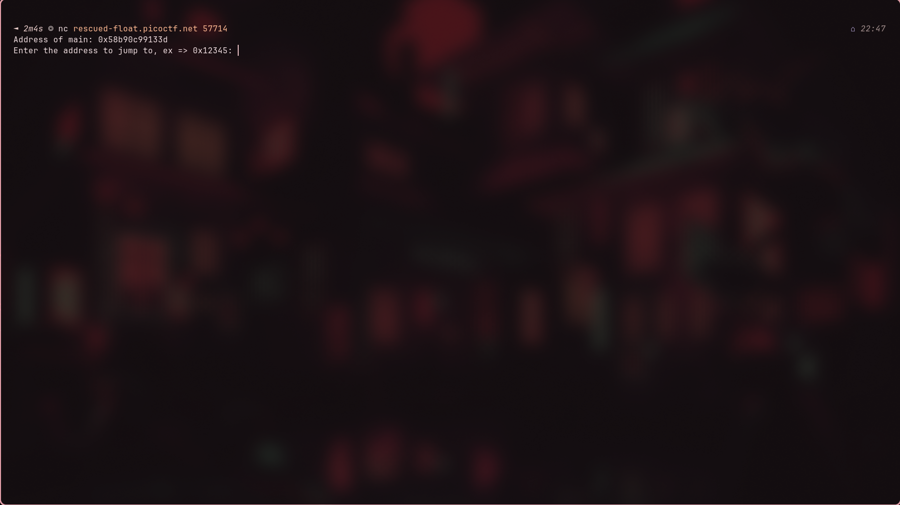
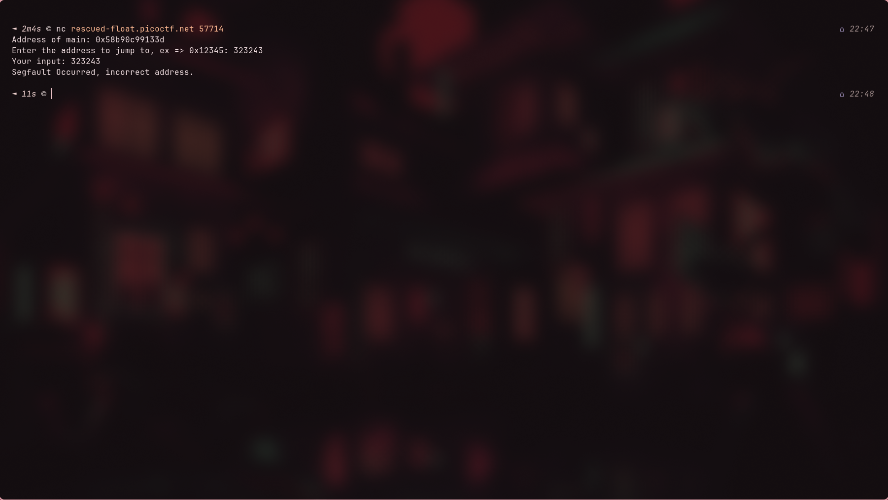
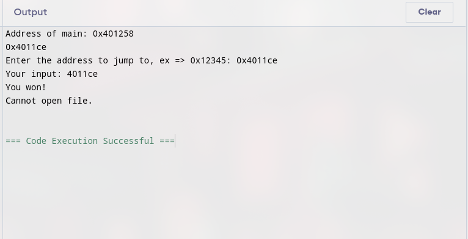
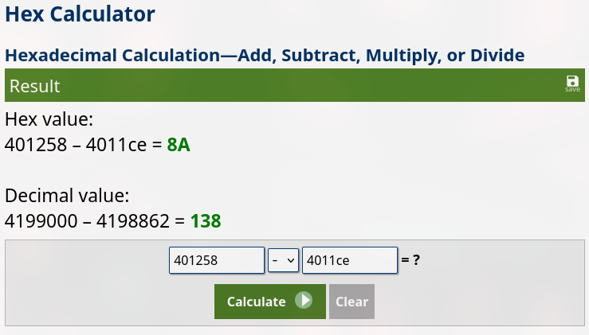
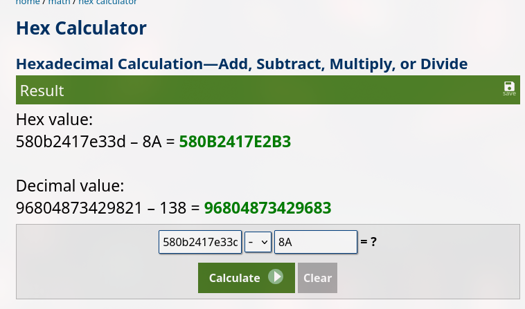
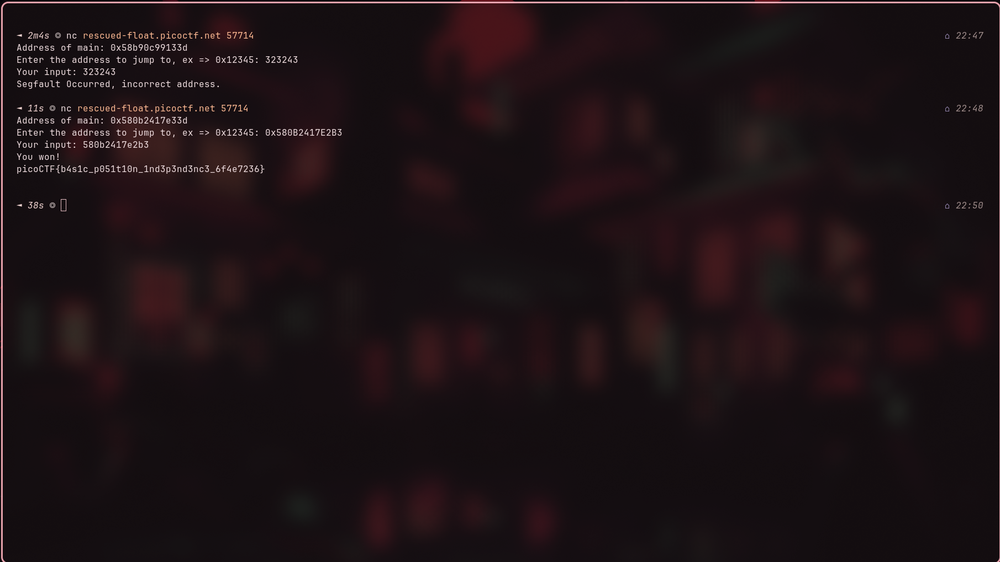

# PIE TIME - Binary Exploitation

**Author:**  Frenz Nicole Repunte <br>
**Challenge Link:** https://play.picoctf.org/practice/challenge/490  <br>
**Date:** 2025-10-10 <br>
**Category:** Binary Exploitation  <br>

---

## 🧠 Challenge Description

> Can you try to get the flag? Beware we have PIE!

---

## 📁 Provided Files / Access

- Service: `nc rescued-float.picoctf.net [port]`
- File:  `vuln.c`
- Binary: `vuln`

---

## 🧪 Approach & Strategy

### Goal

Find the flag by calling the function that prints the address. But how do you call the function?

### Tools / Techniques

List tools or concepts used. For example:

- C Memory Addresses
- Hexadecimal Arithmetic

---

## 🛠️ Step-by-step Solution

1. When running `nc rescued-float.picoctf.net [port]`, you will be shown this screen.
   
   
   When inputting a string of numbers, you get a segfault message. 
   
   
   It doesn't tell us much other than we need an address to get to somewhere. Let's see if opening the code helps us somehow.

2. Opening the file, we can see a win function that opens a `flag.txt` file. 
   
```c
#include <stdio.h>
#include <stdlib.h>
#include <signal.h>
#include <unistd.h>

void segfault_handler() {
  printf("Segfault Occurred, incorrect address.\n");
  exit(0);
}

int win() {
  FILE *fptr;
  char c;

  printf("You won!\n");
  // Open file
  fptr = fopen("flag.txt", "r");
  if (fptr == NULL)
  {
      printf("Cannot open file.\n");
      exit(0);
  }

  // Read contents from file
  c = fgetc(fptr);
  while (c != EOF)
  {
      printf ("%c", c);
      c = fgetc(fptr);
  }

  printf("\n");
  fclose(fptr);
}

int main() {
  signal(SIGSEGV, segfault_handler);
  setvbuf(stdout, NULL, _IONBF, 0); // _IONBF = Unbuffered

  printf("Address of main: %p\n", &main);
  unsigned long val;
  printf("Enter the address to jump to, ex => 0x12345: ");
  scanf("%lx", &val);
  printf("Your input: %lx\n", val);

  void (*foo)(void) = (void (*)())val;
  foo();
}
```
   
   Since we know it reveals the address of the main function each time, we can tell that we need to find the memory address of the win function.

3. I ran this on an online C compiler and tried printing the address of `win()` along with the main function.
   
   

4. Seeing the hexadecimal difference between addresses of `main()` and `win()`, we get **8A**.

   
   
5. All we have to do now is take the address of main from the netcat and subtract 8A from it to get the flag.
   
   
   
   