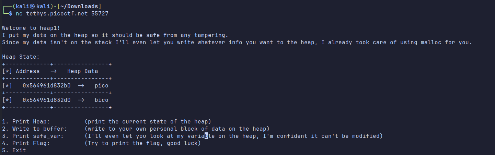
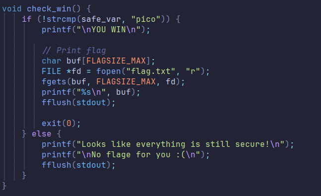
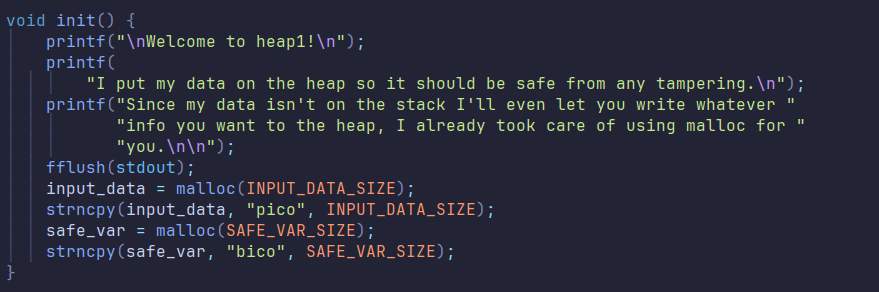
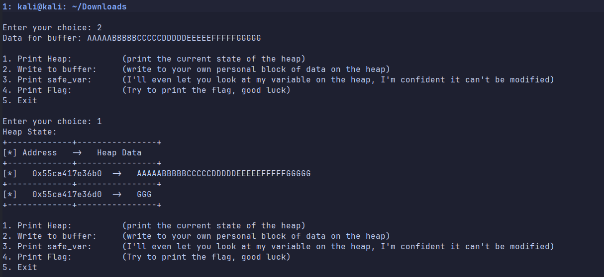
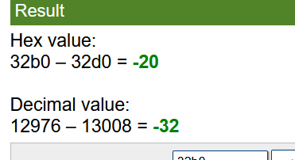
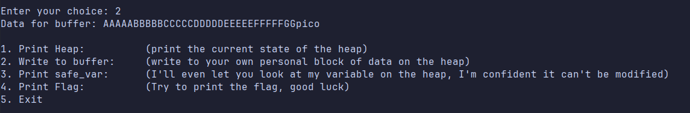
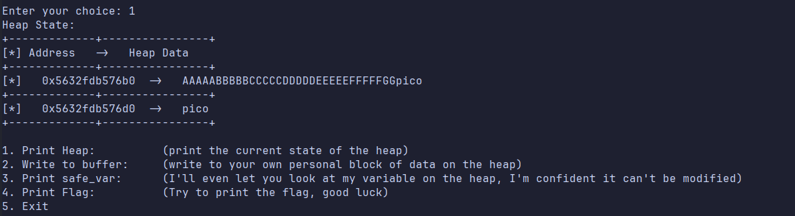
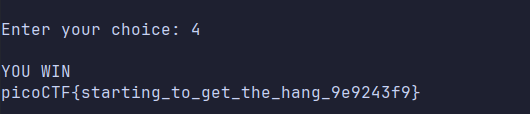

# PIE TIME - Binary Exploitation

**Author:**  Ray Anthony F. Dollison<br>
**Challenge Link:** https://play.picoctf.org/practice/challenge/439<br>
**Date:** 2025-10-11 <br>
**Category:** Binary Exploitation  <br>

---

## 🧠 Challenge Description

> Can you control your overflow?

---

## 📁 Provided Files / Access

- Service: `nc tethys.picoctf.net [port]`
- File:  `chall.c`
- Binary: `chall`

---

## 🧪 Approach & Strategy

### Goal

Find the change a variable's value via buffer overflow

### Tools / Techniques

List tools or concepts used. For example:

- text editor / something that can open a .c file
-  Hex Arithmeric (optional)

---

## 🛠️ Step-by-step Solution

### 1. When running `nc tethys.picoctf.net [port]` youll be shown the following
   
   
   you'll be shown the main menu of the program, you're given 5 options
   
   1. Print Heap - prints 2 adresses and their values these are the input buffer and the safe_var
   2. Write to buffer - takes an input and stores the value to the input buffer (its the first item in the heap table)
   3. Print safe_var - prints the value of the safe_var (redundant since we can just use Option 1)
   4. Print Flag - does the validation for the challenge and prints the flag
   5. Exit - closes the program
   
   the main options that we'll be choosing is 1 and 2

### 2. Opening the .c file shows us the following
```c
#include <stdio.h>
#include <stdlib.h>
#include <string.h>

#define FLAGSIZE_MAX 64
// amount of memory allocated for input_data
#define INPUT_DATA_SIZE 5
// amount of memory allocated for safe_var
#define SAFE_VAR_SIZE 5

int num_allocs;
char *safe_var;
char *input_data;

void check_win() {
    if (!strcmp(safe_var, "pico")) {
        printf("\nYOU WIN\n");

        // Print flag
        char buf[FLAGSIZE_MAX];
        FILE *fd = fopen("flag.txt", "r");
        fgets(buf, FLAGSIZE_MAX, fd);
        printf("%s\n", buf);
        fflush(stdout);

        exit(0);
    } else {
        printf("Looks like everything is still secure!\n");
        printf("\nNo flage for you :(\n");
        fflush(stdout);
    }
}

void print_menu() {
    printf("\n1. Print Heap:\t\t(print the current state of the heap)"
           "\n2. Write to buffer:\t(write to your own personal block of data "
           "on the heap)"
           "\n3. Print safe_var:\t(I'll even let you look at my variable on "
           "the heap, "
           "I'm confident it can't be modified)"
           "\n4. Print Flag:\t\t(Try to print the flag, good luck)"
           "\n5. Exit\n\nEnter your choice: ");
    fflush(stdout);
}

void init() {
    printf("\nWelcome to heap1!\n");
    printf(
        "I put my data on the heap so it should be safe from any tampering.\n");
    printf("Since my data isn't on the stack I'll even let you write whatever "
           "info you want to the heap, I already took care of using malloc for "
           "you.\n\n");
    fflush(stdout);
    input_data = malloc(INPUT_DATA_SIZE);
    strncpy(input_data, "pico", INPUT_DATA_SIZE);
    safe_var = malloc(SAFE_VAR_SIZE);
    strncpy(safe_var, "bico", SAFE_VAR_SIZE);
}

void write_buffer() {
    printf("Data for buffer: ");
    fflush(stdout);
    scanf("%s", input_data);
}

void print_heap() {
    printf("Heap State:\n");
    printf("+-------------+----------------+\n");
    printf("[*] Address   ->   Heap Data   \n");
    printf("+-------------+----------------+\n");
    printf("[*]   %p  ->   %s\n", input_data, input_data);
    printf("+-------------+----------------+\n");
    printf("[*]   %p  ->   %s\n", safe_var, safe_var);
    printf("+-------------+----------------+\n");
    fflush(stdout);
}

int main(void) {

    // Setup
    init();
    print_heap();

    int choice;

    while (1) {
        print_menu();
	if (scanf("%d", &choice) != 1) exit(0);

        switch (choice) {
        case 1:
            // print heap
            print_heap();
            break;
        case 2:
            write_buffer();
            break;
        case 3:
            // print safe_var
            printf("\n\nTake a look at my variable: safe_var = %s\n\n",
                   safe_var);
            fflush(stdout);
            break;
        case 4:
            // Check for win condition
            check_win();
            break;
        case 5:
            // exit
            return 0;
        default:
            printf("Invalid choice\n");
            fflush(stdout);
        }
    }
}
```
the things that we need to focus on is the `check_win` function and the `init` function
 ### Check win function
 
checking the `check_win` function, it compares the `safe_var` variable with the value`pico` and if its the same then we win

 

checking the `init` function, it prints the opening dialogue when we open the program but more importantly:
>  it mallocs the spaces for the input_data and the safe_var

>  it first mallocs the input_data THEN the safe_var

>  this shows that the next closes variable in heap of `input_data` is `safe_var`

**Ladies and gentlemen we just found our vulnerability**


### 3. Find the space between `input_data` and `safe_var`
   we can do this in two ways:
   
   1. calculate the differences berween the adresses (like a fucking nerd)
   2. lets fucking throw 1000 million characters into the input buffer and count when the input overflows to the safe_var

   

   for now, lets go with choice 2

   throwing 1 billion characters into the input data is of course too much but its essentially what where gonna do, instead of 1 billion characters, lets start with small incrememts like maybe 35-40 characters and then the characters until it overflows

   <strong>TIP: For easier counting its best to do multiples of A-Z </strong>
   -
   - Ex: AAAABBBBCCCCDDDD (multiples of 4)
   - this is because when we see the safe_var as `CDDDD` then we can easily subtract the input by the overflow
   ```
   16(4 * ((4)A-F)) - 5(CDDDD) = 11 
   ```
   - you can increase your multiples as you see fit

   
   in my case I did multiples of 5 from A-G
   
   since the overflow is GGG we can say that
   ```
   = (4 * 7 (A-G)) - 3(GGG)
   = 35 - 3
   = 32
   ```

   **so the space between input_var and safe_var is 32**

   now if you're a nerd and did the math between the adresses of `input_var` and `safe_var` you'll probably see this
   

### 4. Getting the flag
   sa you saw on [the check win function](#check-win-function)

   we need to change the `safe_var` to `pico` to win
   
   since we already know the distance between the two variables and what the vulnerabilty is then all we gotta do is 

   **Bing**
   -
   
   **Bang**
   -
   
   **Pow**
   -
   
